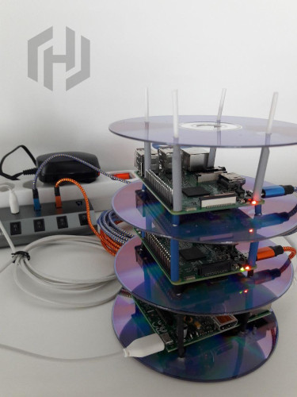

# HashiPi

A RaspberryPi test cluster for HashiCorp Vault and Nomad with Consul storage backend.



## ARM Builder 
These Packer files use the [Packer builder for ARM](https://github.com/mkaczanowski/packer-builder-arm). Follow the instructions in the repo to setup the builder and use the provided [examples](https://github.com/mkaczanowski/packer-builder-arm/tree/master/boards) to modify to your liking.

## Install Custom Nomad Binary

Copy the [pre-built binary](https://github.com/in0rdr/nomad-arm6l) for the target architecture to the `./bin/nomad` path. The binary file can have an arbitrary name, it need not be set to "nomad". Then, in the Packer JSON, set the `nomad_binary_path` to the relative path of the file, e.g., `nomad_binary_path='./bin/nomad'`. Then, the custom binary is used in the installation stage for Nomad (provisionier [`nomad.sh`](./nomad.sh)) in place of the binary from the [HashiCorp release page](releases.hashicorp.com/nomad/).

## Self-signed TLS Certificates
### Consul
The steps to create a set of self-signed certificates for Consul are not fully automated to have control over the certificate generation process.

It would be a minor modification to add the necessary Packe provisioning steps to the JSON file, however, a `consul` on the Packer build host is required to create the initial CA certificate (trust anchor):

```bash
# create consul CA
mkdir -p tls/consul && cd tls
consul tls ca create
```

Then run the script from the projects root directory to create a new set of certificates in the directory `./tls/consul/certs`:
```bash
./consul-tls.sh
```

The script can be run after each flashed Raspberry Pi image to create a fresh set of certificates for "server", "client" and "cli" usage.

### Vault

To create a new self-signed CA certificate for Vault:
```bash
# create Vault self-signed CA certificate in ./tls/vault/
./vault-tls.sh
```

A new self-signed server certificate is created in the Vault provisioning stage.

The Packer JSON supports a few arguments for Vault server certificates:
```json
    "vault_tls_ca_cert": "./tls/vault/ca/vault_ca.pem",
    "vault_tls_ca_key": "./tls/vault/ca/vault_ca.key",
    "vault_tls_subj_alt_name": ""
```

* `vault_tls_ca_cert`: The path of the CA certificate on the Packer build host, e.g., created with `./vault-tls.sh`
* `vault_tls_ca_key`: The path of the CA key on the Packer build host, e.g., created with `./vault-tls.sh`
* `vault_tls_subj_alt_name`: Comma seperated list of Subject Alternative Names (SAN) for the self-signed certificates, e.g., `DNS:vault.example.com`


## ACL's

tbd

* ACLs for Consul
* ACLs for Nomad
* TLS and Gossip encryption for Nomad

## Consul Encryption

Generate a new consul encryption key and set as `consul_encrypt` Packer variable:
```bash
consul keygen
```

## Authorized Keys
Copy the contents of an openssh pubkey to `authorized_keys` Packer variable.

## Troubleshooting

```bash
* Post-processor failed: unexpected EOF
```
Ensure that the `flash_device_path` exists or comment/disable the [flasher `post-processor`](https://github.com/mkaczanowski/packer-post-processor-flasher)

To [write the resulting image file to the sd card](https://www.raspberrypi.org/documentation/installation/installing-images/linux.md) with `dd` without the "flasher" post-processor:

```bash
sudo dd bs=4M if=HashiPi-pi1.img of=/dev/sda status=progress conv=fsync
```

